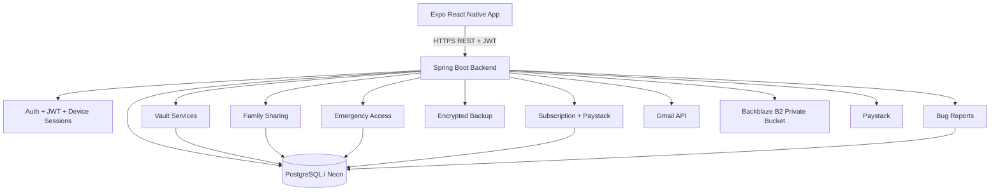

# The Guardian Backend Technical Documentation

## 1. Purpose

The Guardian backend is the secure server-side API for a digital vault mobile application. It supports account creation, login, email verification, JWT-protected access, encrypted vault records, payment-backed subscription upgrades, family sharing, emergency access, recovery kits, device/session management, notifications, encrypted backups, document upload/download, and bug reporting.

The backend is implemented in Java using Spring Boot and exposes REST endpoints consumed by the Expo React Native frontend.

## 2. Technology Stack

| Layer | Technology |
|---|---|
| Runtime language | Java 26 |
| Backend framework | Spring Boot 4.1.0 |
| Build tool | Maven |
| Web framework | Spring Web MVC |
| Security | Spring Security, stateless JWT authentication, BCrypt password hashing |
| Persistence | Spring Data JPA / Hibernate |
| Database | PostgreSQL |
| Database migration | Flyway |
| Validation | Jakarta Bean Validation |
| Email | Gmail API with OAuth refresh token |
| Payments | Paystack integration |
| Object storage | Backblaze B2 through AWS S3-compatible SDK |
| Encryption | AES-GCM through custom vault/document/backup crypto services |
| Deployment | Docker, Render-compatible port binding |

Important dependencies from `pom.xml` include:

```txt
spring-boot-starter-webmvc
spring-boot-starter-security
spring-boot-starter-data-jpa
spring-boot-starter-flyway
spring-boot-starter-validation
spring-boot-starter-mail
spring-boot-starter-webflux
postgresql
jjwt-api / jjwt-impl / jjwt-jackson
software.amazon.awssdk:s3
lombok
jackson-datatype-jsr310
```

## 3. High-Level Architecture



The API follows a service-oriented structure:

```txt
Controller -> Service -> Repository -> Database / External Service
```

Controllers handle request routing. Services contain business logic, encryption, plan checks, and ownership checks. Repositories provide database access through Spring Data JPA.

## 4. Runtime Configuration

The application reads configuration from `application.properties` and environment variables.

| Variable / Property | Purpose | Requirement |
| --- | --- | --- |
| DATABASE_URL | PostgreSQL JDBC URL, commonly Neon/Render value. | Required |
| DATABASE_USERNAME | Database username. | Required |
| DATABASE_PASSWORD | Database password. | Required |
| JWT_SECRET | Strong JWT signing secret. Do not rotate casually or active sessions break. | Required |
| JWT_EXPIRATION | JWT lifetime in milliseconds. | Required |
| VAULT_PASSWORD_SECRET | AES-GCM vault/password/card/note encryption secret. Do not change after data exists. | Required |
| VAULT_DOCUMENT_SECRET | AES-GCM document encryption secret. Do not change after documents exist. | Required |
| BACKUP_SECRET | Secret for encrypted backup payload. Must be strong in production. | Required for backup |
| GMAIL_CLIENT_ID | Google OAuth client id for Gmail API sending. | Required for email |
| GMAIL_CLIENT_SECRET | Google OAuth client secret for Gmail API sending. | Required for email |
| GMAIL_REFRESH_TOKEN | Google refresh token used to obtain Gmail access token. | Required for email |
| GMAIL_FROM | Sender email address. Also fallback support email. | Required for email |
| DEMO_MODE | When true, some email failures do not block auth flows. | Optional; defaults true |
| PORT | Runtime port used by Render. | Optional; defaults 8080 |
| B2_ENABLED | Enable Backblaze B2/S3-compatible object storage for encrypted documents. | Optional; defaults false |
| B2_ENDPOINT | Backblaze S3 endpoint, including https://. | Required if B2 enabled |
| B2_REGION | B2 region. | Required if B2 enabled |
| B2_BUCKET | Private B2 bucket name. | Required if B2 enabled |
| B2_KEY_ID | B2 application key id. | Required if B2 enabled |
| B2_APPLICATION_KEY | B2 application key secret. | Required if B2 enabled |
| ADMIN_SUPPORT_EMAIL | Email address that receives bug report notifications. | Optional; falls back to GMAIL_FROM |
| PAYSTACK_SECRET_KEY / paystack.secret.key | Paystack secret key used by PaystackService. The Java class expects property paystack.secret.key. | Required for payments |
| PAYSTACK_CALLBACK_URL / paystack.callback.url | Callback URL used by PaystackService. The Java class expects property paystack.callback.url. | Required for payments |

### Important secret management rule

Never commit real values for these variables to GitHub:

```txt
JWT_SECRET
VAULT_PASSWORD_SECRET
VAULT_DOCUMENT_SECRET
BACKUP_SECRET
DATABASE_PASSWORD
GMAIL_CLIENT_SECRET
GMAIL_REFRESH_TOKEN
B2_APPLICATION_KEY
PAYSTACK_SECRET_KEY
```

Do not change `VAULT_PASSWORD_SECRET`, `VAULT_DOCUMENT_SECRET`, or `BACKUP_SECRET` after production data exists unless you have built a safe key rotation and data re-encryption process. Existing encrypted records may become unreadable if the secret changes.

## 5. Deployment Model

The uploaded backend includes this Docker strategy:

```dockerfile
FROM eclipse-temurin:26-jdk AS build
WORKDIR /app
RUN apt-get update && apt-get install -y maven && rm -rf /var/lib/apt/lists/*
COPY pom.xml .
RUN mvn dependency:go-offline -B
COPY src ./src
RUN mvn clean package -DskipTests

FROM eclipse-temurin:26-jre
WORKDIR /app
COPY --from=build /app/target/*.jar app.jar
EXPOSE 8080
CMD ["java", "-jar", "app.jar"]
```

For Render, the app listens on:

```properties
server.address=0.0.0.0
server.port=${PORT:8080}
```

This allows Render to inject the runtime port while local development still uses port `8080`.

## 6. Authentication and Authorization

### 6.1 Account registration

`POST /vault/auth/register` creates a new user, hashes their password with BCrypt, creates a Free subscription, sends a welcome/verification email, and returns an `AuthResponse`.

The response contains:

```txt
token
userId
fullName
email
plan
emailVerified
twoFactorEnabled
requiresTwoFactor
```

### 6.2 Login

`POST /vault/auth/login` validates credentials, handles device-session rules, handles 2FA if enabled, and returns a JWT token when login is complete.

The login request supports:

```txt
email
password
forceReplaceDevice
```

`forceReplaceDevice` is used when a Free user wants to replace the previously trusted device.

### 6.3 JWT security

`SecurityConfig` configures stateless sessions:

```txt
CSRF disabled
SessionCreationPolicy.STATELESS
JWT filter before UsernamePasswordAuthenticationFilter
```

The public endpoints are:

```txt
/
/vault/auth/login
/vault/auth/register
/vault/auth/logout
/vault/auth/verify-email
/vault/auth/resend-verification
/vault/auth/forgot-password
/vault/auth/reset-password
/vault/auth/verify-2fa
/vault/recovery-kit/reset-password
/vault/recovery-kit/reset-account
/vault/payments/callback
```

Every other endpoint requires a valid JWT.

### 6.4 Device sessions

The backend stores device sessions in `user_sessions`. Each login can include a stable device ID from the mobile app. The backend hashes that ID into `deviceIdHash` and uses it to identify unique devices without storing the raw device identifier.

Free users are limited to one active device unless they replace the existing device. Paid users can use multiple devices.

Device session endpoints:

```txt
GET    /vault/sessions
DELETE /vault/sessions/<built-in function id>
POST   /vault/sessions/logout-others
POST   /vault/sessions/logout-all
```

## 7. Database Model

The main entities are:

| Entity | Table | Purpose |
|---|---|---|
| `User` | `users` | User identity, password hash, verification codes, 2FA fields |
| `Subscription` | `subscriptions` | Free/Premium/Family plan status and expiry |
| `VaultItem` | `vault_items` | Password/login vault items |
| `CreditCardEntity` | `cards` | Encrypted card records |
| `DocumentVault` | `documents` | Document metadata and encrypted file storage references |
| `SecureNote` | `secure_notes` | Encrypted secure notes |
| `FamilyGroup` | `family_groups` | Family-plan group owned by admin |
| `FamilyMember` | `family_members` | Member relationship and sharing permissions |
| `EmergencyContact` | `emergency_contacts` | Trusted emergency contact configuration |
| `EmergencyAccessRequest` | `emergency_access_requests` | Requests to access vault under emergency rules |
| `EmergencyAccessAuditLog` | `emergency_access_audit_logs` | Audit trail for emergency access actions |
| `UserSession` | `user_sessions` | Device/session registry |
| `RecoveryKit` | `recovery_kits` | Recovery ID and hashed recovery key |
| `AppNotification` | `notifications` | In-app notifications |
| `Payment` | `payments` | Paystack payment records |
| `BugReport` | `bug_reports` | User-submitted bug reports |

## 8. Flyway Migrations

| Migration | Purpose |
| --- | --- |
| V1 | create tables |
| V2 | add subscriptions |
| V3 | add password reset tokens |
| V5 | create payments |
| V6 | create credit cards |
| V7 | create documents |
| V8 | add email verification password reset 2fa to users table |
| V9 | create family tables |
| V10 | add family share type permission |
| V11 | create notifications |
| V12 | add vault item updated at |
| V13 | create secure notes |
| V14 | create emergency access |
| V15 | add family share notes |
| V16 | create user sessions |
| V17 | create recovery kits |
| V18 | add device id hash to user sessions |
| V19 | add b2 document storage columns |
| V20 | create bug reports |

Current latest migration in the uploaded backend is `V20__create_bug_reports.sql`.

## 9. Core Feature Modules

### 9.1 Authentication module

Files:

```txt
AuthController.java
AuthService.java
JwtService.java
SecurityConfig.java
LoginRequest.java
AuthResponse.java
RegisterRequest.java
VerifyEmailRequest.java
VerifyTwoFactorRequest.java
ForgotPasswordRequest.java
ResetPasswordRequest.java
```

Responsibilities:

```txt
Register users
Hash passwords
Issue JWTs
Verify email codes
Send and verify 2FA codes
Send and verify password reset codes
Create device sessions
Return security settings
```

Security details:

```txt
Passwords are stored as BCrypt hashes, not plaintext.
JWTs are signed using JWT_SECRET.
Email, password reset, and 2FA codes expire using timestamp columns on users.
```

### 9.2 Vault password module

Files:

```txt
VaultController.java
VaultService.java
VaultItem.java
VaultItemRepository.java
VaultRequest.java
VaultResponse.java
VaultCryptoService.java
```

Endpoints use `/api/vault`, while most other modules use `/vault/...`.

Responsibilities:

```txt
Create password/login entries
List owned password entries
Read one owned entry
Update owned entry
Delete owned entry
Encrypt/decrypt password values for storage/response
Notify user when password is added
Enforce Free plan password limit
```

Free plan password limit is currently enforced in `SubscriptionService`:

```java
private static final long FREE_PASSWORD_LIMIT = 10;
```

When limit is reached, `VaultService` throws `PlanLimitException`, which becomes a `403 Forbidden` response with code `PLAN_LIMIT_REACHED`.

### 9.3 Credit card module

Files:

```txt
CreditCardController.java
CreditCardService.java
CreditCardEntity.java
CreditCardRepository.java
CreditCardRequest.java
CreditCardResponse.java
```

Responsibilities:

```txt
Create encrypted card records
List owned cards
Read card details
Update cards
Delete cards
Notify user when card is added
```

Sensitive card fields are stored encrypted:

```txt
encryptedCardNumber
encryptedExpiryDate
encryptedCvv
encryptedCardholderName
```

### 9.4 Document module

Files:

```txt
DocumentController.java
DocumentService.java
DocumentVault.java
DocumentRepository.java
DocumentRequest.java
DocumentResponse.java
B2StorageService.java
```

Responsibilities:

```txt
Create document records
Upload multipart files
Encrypt document bytes before storage
Store encrypted documents locally/in database or in Backblaze B2 depending configuration
Download and decrypt documents through backend-controlled endpoint
Update document metadata
Delete document records and object-storage entries
```

Important endpoints:

```txt
POST /vault/documents/upload
GET  /vault/documents/<built-in function id>/download
```

Document upload is Premium/Family gated through `SubscriptionService.canUploadDocuments(user)`.

### 9.5 Secure notes module

Files:

```txt
SecureNoteController.java
SecureNoteService.java
SecureNote.java
SecureNoteRepository.java
SecureNoteRequest.java
SecureNoteResponse.java
```

Responsibilities:

```txt
Create encrypted secure notes
List notes
Read note detail
Update notes
Delete notes
Handle pinned state
Notify user on note create/update/delete
Enforce Free plan note limit
```

Free secure-note limit is currently:

```java
private static final long FREE_SECURE_NOTE_LIMIT = 5;
```

### 9.6 Subscription module

Files:

```txt
SubscriptionController.java
SubscriptionService.java
Subscription.java
SubscriptionPlan.java
SubscriptionRepository.java
PlanLimitException.java
```

Supported plans:

```txt
FREE
PREMIUM
FAMILY
```

`SubscriptionService` is the central plan-gating service. It controls:

```txt
Free password limit
Free secure note limit
Document upload access
Backup access
Family sharing access
Advanced security access
Advanced password generator access
Breach monitoring access
Multiple device access
Emergency contact limits
Emergency vault sharing access
Custom emergency waiting period access
```

Current plan constants in uploaded files:

```java
private static final long FREE_PASSWORD_LIMIT = 10;
private static final long FREE_SECURE_NOTE_LIMIT = 5;
private static final long FREE_EMERGENCY_CONTACT_LIMIT = 1;
private static final long PREMIUM_EMERGENCY_CONTACT_LIMIT = 3;
private static final long FAMILY_EMERGENCY_CONTACT_LIMIT = 6;
```

### 9.7 Payment module

Files:

```txt
PaymentController.java
PaystackService.java
Payment.java
PaymentRepository.java
InitializePaymentRequest.java
InitializePaymentResponse.java
VerifyPaymentRequest.java
VerifyPaymentResponse.java
```

Responsibilities:

```txt
Create Paystack payment initialization
Store payment reference and status
Verify Paystack payment
Activate subscription on successful payment
Render an HTML callback result page
```

Payment endpoints:

```txt
POST /vault/payments/initialize
POST /vault/payments/verify
GET  /vault/payments/callback?reference=...
```

### 9.8 Family sharing module

Files:

```txt
FamilyController.java
FamilyService.java
FamilyGroup.java
FamilyMember.java
FamilyGroupRepository.java
FamilyMemberRepository.java
Shared*Response.java
AddFamilyMemberRequest.java
```

Responsibilities:

```txt
Create/read family overview
Lookup potential member email
Add/remove family members
Control sharing permissions by item type
List shared password/card/document/note summaries
Return detail only when permission allows
Download shared documents through backend
Return family password risk summaries without exposing actual passwords to admin
```

Family sharing is gated to Family plan users. Sharing permissions are per member:

```txt
sharePasswords
shareCards
shareDocuments
shareNotes
```

### 9.9 Emergency access module

Files:

```txt
EmergencyAccessController.java
EmergencyAccessService.java
EmergencyContact.java
EmergencyAccessRequest.java
EmergencyAccessAuditLog.java
Emergency*Request/Response.java
```

Responsibilities:

```txt
Create trusted emergency contacts
Configure waiting periods
Configure allowed item types
Allow contact to request access
Allow owner to approve/deny requests
Auto-release eligible requests after waiting period
Expose emergency vault items only after release
Write audit logs for emergency actions
Notify affected users
```

Emergency contacts have permissions:

```txt
allowPasswords
allowCards
allowDocuments
allowNotes
```

The emergency audit trail records major actions such as request, approval, denial, release, and vault viewing.

### 9.10 Recovery kit module

Files:

```txt
RecoveryKitController.java
RecoveryKitService.java
RecoveryKit.java
RecoveryKitRepository.java
RecoveryKitGenerateRequest.java
RecoveryKitResponse.java
RecoveryKitStatusResponse.java
RecoveryPasswordResetRequest.java
AccountResetEraseRequest.java
```

Responsibilities:

```txt
Generate recovery ID and recovery key
Store only the hash of the recovery key
Allow password reset with recovery kit
Allow account reset and vault erasure with recovery kit
Revoke active recovery kits
Revoke sessions after recovery actions
Notify user when recovery kit is created/used/revoked
```

Critical security rule:

```txt
The plaintext recovery key should only be shown once. The backend stores only the hash.
```

### 9.11 Backup module

Files:

```txt
BackupController.java
BackupService.java
BackupResponse.java
BackupRestoreRequest.java
BackupRestoreResponse.java
BackupStatusResponse.java
```

Responsibilities:

```txt
Check backup eligibility
Create encrypted backup payload
Calculate checksum
Restore backup contents
Optionally replace existing records during restore
Notify user when backup is created/restored
```

Backup access is Premium/Family gated. Backup encryption uses `BACKUP_SECRET`.

### 9.12 Notifications module

Files:

```txt
NotificationController.java
NotificationService.java
AppNotification.java
NotificationRepository.java
NotificationResponse.java
NotificationType.java
UnreadCountResponse.java
```

Responsibilities:

```txt
Create in-app notifications for important actions
List notifications
Read unread count
Mark one/all notifications as read
Delete notification
```

NotificationService centralizes message creation for actions including welcome, subscription changes, backup events, vault additions, family changes, emergency access, recovery kit events, security scan alerts, and device login/revocation.

### 9.13 Security Health module

Files:

```txt
SecurityAlertController.java
SecurityAlertRequest.java
SubscriptionService.java
NotificationService.java
```

The frontend performs most security scoring, while the backend receives scan summaries at:

```txt
POST /vault/security-alerts/scan
```

If the scan is concerning, the backend can create notifications for the user. Advanced security and breach monitoring are Premium/Family gated through `SubscriptionService`.

### 9.14 Bug report module

Files:

```txt
BugReportController.java
BugReportService.java
BugReport.java
BugReportRepository.java
BugReportRequest.java
BugReportResponse.java
EmailService.java
```

Responsibilities:

```txt
Allow logged-in users to submit bug reports
Validate report title/category/severity/description
Save reports in PostgreSQL
Send admin/support email notification
Allow user to list their submitted reports
```

Bug reports are stored in `bug_reports`. Email notification uses:

```properties
support.admin-email=${ADMIN_SUPPORT_EMAIL:${GMAIL_FROM:}}
```

So Render should define:

```txt
ADMIN_SUPPORT_EMAIL=your-support-email@example.com
```

If email sending fails, the report remains saved in the database.

### 9.15 User account deletion module

Files:

```txt
UserController.java
UserService.java
DeleteAccountRequest.java
DeleteAccountResponse.java
```

Responsibilities:

```txt
Delete current authenticated user after password confirmation
Rely on database ON DELETE CASCADE to clean related records
Return user-friendly deletion response
```

## 10. Encryption Strategy

The backend uses encryption for sensitive vault data.

### 10.1 Password/card/note value encryption

`VaultCryptoService` uses `vault.password.secret` to encrypt and decrypt sensitive text values. It supports a versioned encryption format and legacy frontend-encoded values.

Sensitive fields include:

```txt
Vault password values
Card number
Card expiry
Card CVV
Cardholder name
Secure note content
Emergency note content
```

### 10.2 Document encryption

`DocumentService` encrypts file bytes using `vault.document.secret` before storing them. The private B2 bucket stores encrypted bytes only.

The backend must stay in the middle of document downloads:

```txt
Mobile app -> Backend authorized download endpoint -> B2 encrypted object -> Backend decrypts -> Mobile app
```

Do not expose private B2 URLs directly to users.

### 10.3 Backup encryption

`BackupService` uses `vault.backup.secret` to encrypt generated backup payloads. Backups include vault metadata and encrypted record values in a portable payload.

## 11. Plan Gates and Limits

`SubscriptionService` is the single best place to adjust plan access rules.

Current behavior:

| Feature | Free | Premium | Family |
|---|---:|---:|---:|
| Password/login items | 10 | Unlimited | Unlimited |
| Secure notes | 5 | Unlimited | Unlimited |
| Document uploads | No | Yes | Yes |
| Backup/restore | No | Yes | Yes |
| Family sharing | No | No | Yes |
| Advanced security | No | Yes | Yes |
| Advanced password generator | No | Yes | Yes |
| Breach monitoring | No | Yes | Yes |
| Multiple devices | No | Yes | Yes |
| Emergency contacts | 1 | 3 | 6 |
| Custom emergency waiting period | No | Yes | Yes |
| Emergency vault item sharing | No | Yes | Yes |

To change the Free password limit, edit:

```java
private static final long FREE_PASSWORD_LIMIT = 10;
```

To change secure note limits, edit:

```java
private static final long FREE_SECURE_NOTE_LIMIT = 5;
```

To change emergency contact limits, edit:

```java
private static final long FREE_EMERGENCY_CONTACT_LIMIT = 1;
private static final long PREMIUM_EMERGENCY_CONTACT_LIMIT = 3;
private static final long FAMILY_EMERGENCY_CONTACT_LIMIT = 6;
```

## 12. Error Handling

`GlobalExceptionHandler` handles:

```txt
PlanLimitException -> 403 PLAN_LIMIT_REACHED
ResponseStatusException -> status-specific JSON
MethodArgumentNotValidException -> 400 VALIDATION_ERROR
```

Plan limit errors include feature and limit:

```json
{
  "code": "PLAN_LIMIT_REACHED",
  "message": "Your Free plan can save up to 10 passwords. Upgrade to Premium or Family for unlimited password storage.",
  "feature": "passwords",
  "limit": 10
}
```

This is important because the frontend can show friendly upgrade prompts instead of generic session-expired messages.

## 13. Email System

`EmailService` sends HTML emails through the Gmail API. It supports:

```txt
Email verification code
Password reset code
Two-factor authentication code
Bug report admin notification
```

Required Gmail environment variables:

```txt
GMAIL_CLIENT_ID
GMAIL_CLIENT_SECRET
GMAIL_REFRESH_TOKEN
GMAIL_FROM
```

`DEMO_MODE=true` means certain email failures will not block signup/login flows. This is helpful while testing but should be reviewed for production.

## 14. Storage System

### 14.1 Database storage

Most structured application data is stored in PostgreSQL.

### 14.2 Backblaze B2 object storage

`B2StorageService` supports encrypted document object storage using S3-compatible Backblaze B2 configuration.

Required when enabled:

```txt
B2_ENABLED=true
B2_ENDPOINT=https://s3.<region>.backblazeb2.com
B2_REGION=<region>
B2_BUCKET=<private-bucket>
B2_KEY_ID=<key-id>
B2_APPLICATION_KEY=<application-key>
```

Keep the bucket private. Store only encrypted bytes.

## 15. API Reference

A separate API reference is included in:

```txt
docs/backend-api-reference.md
```

The main endpoint table is also summarized below.

| Module | Method | Endpoint | Auth | Purpose | Request | Response |
|---|---:|---|---|---|---|---|
| Authentication | POST | /vault/auth/register | Public | Create user account, default Free subscription, verification code, login session. | RegisterRequest | AuthResponse |
| Authentication | POST | /vault/auth/login | Public | Authenticate user with email/password; may require 2FA; creates device session. | LoginRequest | AuthResponse |
| Authentication | POST | /vault/auth/verify-2fa | Public | Complete two-factor login using emailed code. | VerifyTwoFactorRequest | AuthResponse |
| Authentication | GET | /vault/auth/me/security | JWT | Return email verification and 2FA settings. | - | SecuritySettingsResponse |
| Authentication | PUT | /vault/auth/2fa | JWT | Enable or disable two-factor authentication. | TwoFactorToggleRequest | SecuritySettingsResponse |
| Authentication | POST | /vault/auth/verify-email | Public | Verify account email using verification code. | VerifyEmailRequest | MessageResponse |
| Authentication | POST | /vault/auth/resend-verification | Public | Send a new email verification code. | ResendVerificationRequest | MessageResponse |
| Authentication | POST | /vault/auth/forgot-password | Public | Send password reset code by email. | ForgotPasswordRequest | MessageResponse |
| Authentication | POST | /vault/auth/reset-password | Public | Reset password using email and code. | ResetPasswordRequest | MessageResponse |
| Authentication | POST | /vault/auth/logout | Public | Returns logout acknowledgement. Client removes token. | - | LogoutResponse |
| Vault passwords | POST | /api/vault | JWT | Create password/login vault item. Free users are limited. | VaultRequest | VaultResponse |
| Vault passwords | GET | /api/vault | JWT | List current user password/login items. | - | List<VaultResponse> |
| Vault passwords | GET | /api/vault/{id} | JWT | Read one owned password item. | - | VaultResponse |
| Vault passwords | PUT | /api/vault/{id} | JWT | Update an owned password item. | VaultRequest | VaultResponse |
| Vault passwords | DELETE | /api/vault/{id} | JWT | Delete an owned password item. | - | void |
| Cards | POST | /vault/cards | JWT | Create encrypted credit/debit card record. | CreditCardRequest | CreditCardResponse |
| Cards | GET | /vault/cards | JWT | List current user cards. | - | List<CreditCardResponse> |
| Cards | GET | /vault/cards/{id} | JWT | Read one owned card. | - | CreditCardResponse |
| Cards | PUT | /vault/cards/{id} | JWT | Update one owned card. | CreditCardRequest | CreditCardResponse |
| Cards | DELETE | /vault/cards/{id} | JWT | Delete one owned card. | - | void |
| Documents | POST | /vault/documents | JWT | Create legacy/document metadata record from JSON payload. | DocumentRequest | DocumentResponse |
| Documents | POST | /vault/documents/upload | JWT | Upload multipart file; backend encrypts and stores in DB/B2 depending config. | multipart file + metadata | DocumentResponse |
| Documents | GET | /vault/documents | JWT | List current user documents. | - | List<DocumentResponse> |
| Documents | GET | /vault/documents/{id} | JWT | Read one document metadata record. | - | DocumentResponse |
| Documents | GET | /vault/documents/{id}/download | JWT | Download decrypted file bytes for owned document. | - | binary response |
| Documents | PUT | /vault/documents/{id} | JWT | Update document metadata. | DocumentRequest | DocumentResponse |
| Documents | DELETE | /vault/documents/{id} | JWT | Delete document metadata and B2 object when applicable. | - | void |
| Secure notes | POST | /vault/notes | JWT | Create encrypted secure note. Free users are limited. | SecureNoteRequest | SecureNoteResponse |
| Secure notes | GET | /vault/notes | JWT | List secure notes. | - | List<SecureNoteResponse> |
| Secure notes | GET | /vault/notes/{id} | JWT | Read one owned note. | - | SecureNoteResponse |
| Secure notes | PUT | /vault/notes/{id} | JWT | Update one owned note. | SecureNoteRequest | SecureNoteResponse |
| Secure notes | DELETE | /vault/notes/{id} | JWT | Delete one owned note. | - | void |
| Subscription | GET | /vault/api/subscriptions/me | JWT | Return current user subscription; creates Free subscription if missing and refreshes expired paid plan. | - | Subscription |
| Subscription | POST | /vault/api/subscriptions/upgrade?plan=PREMIUM | JWT | Manual plan upgrade endpoint; usually called by payment verification. | plan query param | Subscription |
| Subscription | POST | /vault/api/subscriptions/cancel | JWT | Cancel current paid plan; downgrade to Free. | - | Subscription |
| Payments | POST | /vault/payments/initialize | JWT | Create Paystack payment initialization for plan upgrade. | InitializePaymentRequest | InitializePaymentResponse |
| Payments | POST | /vault/payments/verify | JWT | Verify payment by reference and activate subscription on success. | VerifyPaymentRequest | VerifyPaymentResponse |
| Payments | GET | /vault/payments/callback?reference=... | Public | Browser callback page for Paystack payment result. | reference query param | HTML |
| Family sharing | GET | /vault/family | JWT | Return family plan overview, members, and shared owners. | - | FamilyOverviewResponse |
| Family sharing | GET | /vault/family/members/lookup?email=... | JWT | Lookup whether an email belongs to an existing user before adding. | email query param | Map/ResponseEntity |
| Family sharing | POST | /vault/family/members | JWT | Add family member with sharing permissions. Family plan admin only. | AddFamilyMemberRequest | FamilyMemberResponse |
| Family sharing | DELETE | /vault/family/members/{membershipId} | JWT | Remove family member. Family admin only. | - | void |
| Family sharing | GET | /vault/family/shared-items | JWT | List all shared item groups available to current user. | - | SharedFamilyItemsResponse |
| Family sharing | GET | /vault/family/member-password-risks | JWT | Return risk-only summaries for family admin security view. | - | List<FamilyMemberPasswordRiskResponse> |
| Family sharing | GET | /vault/family/shared-passwords | JWT | List shared password summaries. | - | List<SharedPasswordItemResponse> |
| Family sharing | GET | /vault/family/shared-passwords/{itemId} | JWT | Read shared password detail if permission allows. | - | SharedPasswordItemResponse |
| Family sharing | GET | /vault/family/shared-cards | JWT | List shared card summaries. | - | List<SharedCardItemResponse> |
| Family sharing | GET | /vault/family/shared-cards/{itemId} | JWT | Read shared card detail if permission allows. | - | SharedCardItemResponse |
| Family sharing | GET | /vault/family/shared-documents | JWT | List shared document summaries. | - | List<SharedDocumentItemResponse> |
| Family sharing | GET | /vault/family/shared-documents/{itemId} | JWT | Read shared document metadata/detail if permission allows. | - | SharedDocumentItemResponse |
| Family sharing | GET | /vault/family/shared-documents/{itemId}/download | JWT | Download decrypted shared document if permission allows. | - | binary response |
| Family sharing | GET | /vault/family/shared-notes | JWT | List shared note summaries. | - | List<SharedNoteItemResponse> |
| Family sharing | GET | /vault/family/shared-notes/{itemId} | JWT | Read shared note detail if permission allows. | - | SharedNoteItemResponse |
| Emergency access | GET | /vault/emergency/overview | JWT | Return contacts, received/sent requests, audit logs, plan limits. | - | EmergencyOverviewResponse |
| Emergency access | GET | /vault/emergency/contacts | JWT | List emergency contacts owned by user. | - | List<EmergencyContactResponse> |
| Emergency access | POST | /vault/emergency/contacts | JWT | Create emergency contact with item permissions and waiting period. | EmergencyContactRequest | EmergencyContactResponse |
| Emergency access | GET | /vault/emergency/contacts/{id} | JWT | Read owned emergency contact. | - | EmergencyContactResponse |
| Emergency access | PUT | /vault/emergency/contacts/{id} | JWT | Update owned emergency contact. | EmergencyContactRequest | EmergencyContactResponse |
| Emergency access | DELETE | /vault/emergency/contacts/{id} | JWT | Delete/deactivate emergency contact. | - | void |
| Emergency access | POST | /vault/emergency/requests | JWT | Request emergency access as trusted contact. | EmergencyAccessRequestDto | EmergencyAccessRequestResponse |
| Emergency access | GET | /vault/emergency/requests | JWT | List requests received by vault owner. | - | List<EmergencyAccessRequestResponse> |
| Emergency access | POST | /vault/emergency/requests/{id}/approve | JWT | Approve request immediately. | - | EmergencyAccessRequestResponse |
| Emergency access | POST | /vault/emergency/requests/{id}/deny | JWT | Deny request. | - | EmergencyAccessRequestResponse |
| Emergency access | GET | /vault/emergency/requests/{id}/vault | JWT | List vault items released under emergency access. | - | EmergencyVaultItemsResponse |
| Emergency access | GET | /vault/emergency/requests/{id}/vault/{itemType}/{itemId} | JWT | Read released emergency item detail. | - | EmergencyVaultItemResponse |
| Emergency access | GET | /vault/emergency/audit | JWT | List emergency access audit logs. | - | List<EmergencyAuditLogResponse> |
| Backup | GET | /vault/backup/status | JWT | Return backup eligibility and current counts. Premium/Family only. | - | BackupStatusResponse |
| Backup | POST | /vault/backup/create | JWT | Create encrypted backup payload. Premium/Family only. | - | BackupResponse |
| Backup | POST | /vault/backup/restore | JWT | Restore encrypted backup payload. Premium/Family only. | BackupRestoreRequest | BackupRestoreResponse |
| Recovery kit | GET | /vault/recovery-kit/status | JWT | Return whether recovery kit exists. | - | RecoveryKitStatusResponse |
| Recovery kit | POST | /vault/recovery-kit/generate | JWT | Generate recovery id/key after password confirmation. | RecoveryKitGenerateRequest | RecoveryKitResponse |
| Recovery kit | DELETE | /vault/recovery-kit | JWT | Revoke active recovery kit. | - | MessageResponse |
| Recovery kit | POST | /vault/recovery-kit/reset-password | Public | Reset password using recovery id/key. | RecoveryPasswordResetRequest | MessageResponse |
| Recovery kit | POST | /vault/recovery-kit/reset-account | Public | Reset account and erase vault using recovery id/key. | AccountResetEraseRequest | MessageResponse |
| Notifications | GET | /vault/notifications | JWT | List notifications for current user. | - | List<NotificationResponse> |
| Notifications | GET | /vault/notifications/unread-count | JWT | Return unread notification count. | - | UnreadCountResponse |
| Notifications | PUT | /vault/notifications/{id}/read | JWT | Mark one notification as read. | - | NotificationResponse |
| Notifications | PUT | /vault/notifications/read-all | JWT | Mark all notifications as read. | - | void |
| Notifications | DELETE | /vault/notifications/{id} | JWT | Delete notification. | - | void |
| Device sessions | GET | /vault/sessions | JWT | List active/revoked sessions and current device. | - | List<DeviceSessionResponse> |
| Device sessions | DELETE | /vault/sessions/{id} | JWT | Revoke one session. | - | void |
| Device sessions | POST | /vault/sessions/logout-others | JWT | Revoke all sessions except current. | - | void |
| Device sessions | POST | /vault/sessions/logout-all | JWT | Revoke all user sessions. | - | void |
| Security health | POST | /vault/security-alerts/scan | JWT | Save/send notification summary for security scan results. | SecurityAlertRequest | MessageResponse |
| Bug reports | POST | /vault/support/bug-reports | JWT | Create bug report and notify support email. | BugReportRequest | BugReportResponse |
| Bug reports | GET | /vault/support/bug-reports/my | JWT | List current user bug reports. | - | List<BugReportResponse> |
| User account | DELETE | /vault/users/me | JWT | Delete current account after password confirmation. | DeleteAccountRequest | DeleteAccountResponse |

## 16. Local Development Setup

### 16.1 Prerequisites

```txt
Java 26
Maven
PostgreSQL database
Environment variables configured
```

### 16.2 Run locally

From the backend project root:

```bash
mvn clean install
mvn spring-boot:run
```

The backend should start on:

```txt
http://localhost:8080
```

For testing from a physical mobile phone, use the laptop LAN IP instead of `localhost`.

### 16.3 Test health manually

Use browser/Postman:

```txt
GET http://localhost:8080/
POST http://localhost:8080/vault/auth/login
```

If the app is deployed on Render:

```txt
https://the-guardian-op6t.onrender.com
```

## 17. Production Checklist

Before production release:

```txt
Use strong JWT/encryption/backup secrets.
Confirm secrets are set only in Render environment, not committed.
Confirm B2 bucket is private.
Confirm Gmail API refresh token works.
Confirm Paystack callback URL points to production backend.
Set DEMO_MODE carefully; review whether email failures should block flows.
Run all Flyway migrations successfully.
Test account registration, login, 2FA, password reset, recovery kit, payment, and document upload/download.
Test Free/Premium/Family plan gates.
Test emergency access waiting period and audit logs.
Test bug report email notification and database persistence.
Verify frontend handles 401 vs 403 plan-limit responses correctly.
```

## 18. Security Considerations

Important protections already present:

```txt
BCrypt password hashing
JWT stateless authentication
Device session tracking
Stable device ID hashing
AES-GCM encryption for sensitive vault values
Encrypted document storage
Private object storage bucket
Recovery key hashing
Owner checks in services
Plan-gated sensitive features
Audit logs for emergency access
Validation annotations on request DTOs
Central error handling for plan limits and validation errors
```

Important limitations and future improvements:

```txt
Add admin-only bug report management endpoints and dashboard.
Add backend card-count limits if card limits must be enforced server-side.
Add stronger structured error codes for every business rule, not only plan limits.
Add rate limiting on login, email verification, password reset, 2FA, and recovery endpoints.
Add OpenAPI/Swagger documentation for easier API testing.
Add automated tests for each service and controller.
Add key rotation plan for encryption secrets.
Add audit logs for vault item read/download actions, especially document downloads and shared access.
Add monitoring/log aggregation for Render production errors.
```

## 19. Suggested Repository Documentation Structure

Place this documentation in the repository like this:

```txt
The_Guardian/
├── backend/
├── mobile/
├── docs/
│   ├── backend-technical-documentation.md
│   ├── backend-api-reference.md
│   └── frontend-technical-documentation.md
└── README.md
```

## 20. Maintenance Guide

When adding a new backend feature:

```txt
1. Create or update entity/model.
2. Add repository methods.
3. Add service business logic.
4. Add controller endpoint.
5. Add request/response DTOs.
6. Add Flyway migration if database schema changes.
7. Add plan gates in SubscriptionService if needed.
8. Add notifications if user should be informed.
9. Add error handling codes if frontend needs friendly messages.
10. Update this documentation and API reference.
```